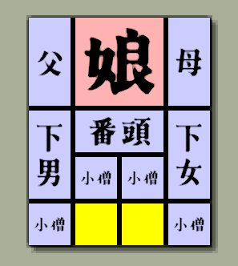
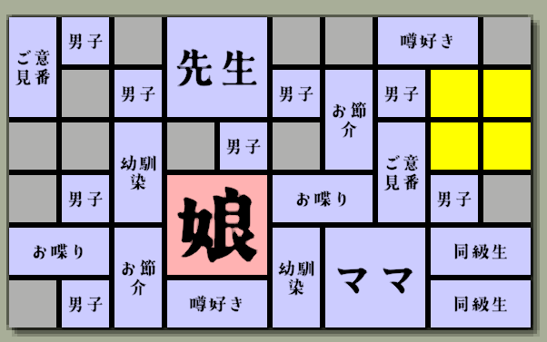

# パズルゲーム「箱入り娘」

https://ushibutatory.github.io/game-hakoirimusume-pages/

## なにこれ

- 箱入り娘のゲームを実装しました。
  - ランダムステージは、選ぶたびに生成されます。
- MVVMパターン、MessagePipeによるメッセージングの練習がメインなので、品質は高くありません。
  - 個人的に優先度が低いと判断したバグ等は積極的に放置しています。
- Unity 6

### 使わせていただいたアセット

- Cartoon FX Remaster
  - 花火のパーティクル
- Free Fireworks
  - 花火の音
- Free UI Click Sound Pack
  - UI操作音
- Retro synth - 80/90's
  - BGM
